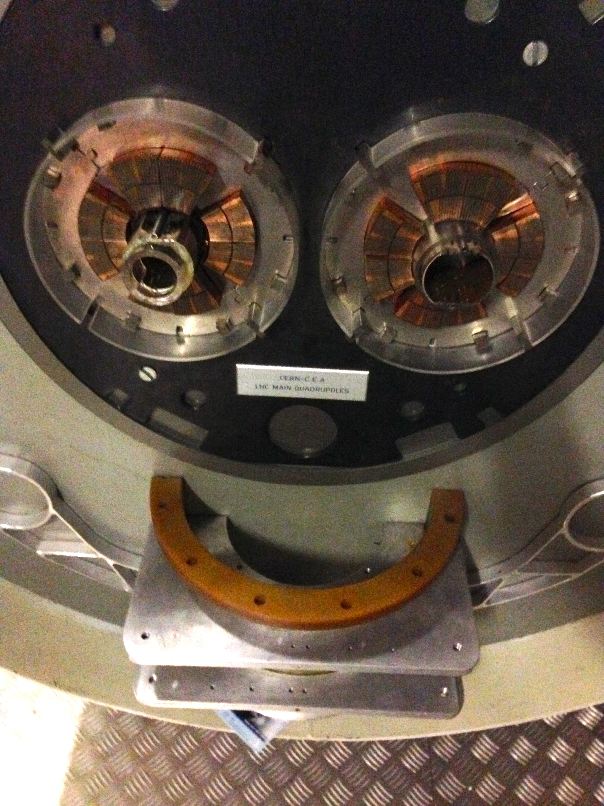

# Mini Class on Higgs Discovery

Mini class at the NYU Physics Department for Spring 2014 about the Higgs Boson discovery. The course web page is here: [http://svenkreiss.github.io/lecturesHiggsPValuation/](http://svenkreiss.github.io/lecturesHiggsPValuation/).

## Lecture 1
__Homework__: watch [Demystifying the Higgs Boson with Leonard Susskind](www.youtube.com/watch?v=JqNg819PiZY) and prepare questions.

## Happy LHC

